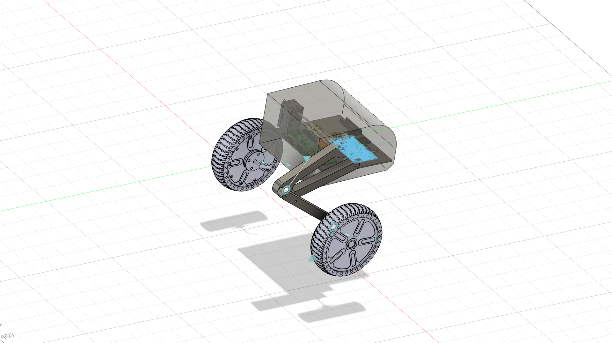

# TWLR — Robot Description



## Overview

| Property | Value |
|----------|-------|
| Total mass | 63.541 kg |
| Links | 7 |
| Joints | 6 (6 movable) |
| Assemblies | 14 |
| Root link | `base_link` |

## Table of Contents

- [Kinematic Tree](#kinematic-tree)
- [Link Properties](#link-properties)
- [Joint Properties](#joint-properties)
- [Assembly Breakdown](#assembly-breakdown)
- [Quick Start (ROS 2)](#quick-start-ros-2)
- [Files](#files)

## Kinematic Tree

```
base_link
  └─ hip_right [continuous]
    link1_right [BAKE]
      └─ knee_right [continuous]
        link3_right [BAKE]
          └─ wheel_right [continuous]
            wheel_right [BAKE]
      └─ hip_left [continuous]
        link1_left [BAKE]
          └─ knee_left [continuous]
            link3_left [BAKE]
              └─ wheel_left [continuous]
                wheel_left [BAKE]
```

## Link Properties

| Link | Mass (kg) | Material | Collision | Bodies |
|------|-----------|----------|-----------|--------|
| `base_link` | 46.8047 | material | cylinder | 1 |
| `link1_left` | 0.6681 | material | box | 1 |
| `link1_right` | 0.6681 | material | box | 1 |
| `link3_left` | 0.8086 | material | cylinder | 1 |
| `link3_right` | 0.8086 | material | cylinder | 1 |
| `wheel_left` | 6.8914 | material | box | 2 |
| `wheel_right` | 6.8914 | material | box | 2 |

## Joint Properties

| Joint | Type | Parent → Child | Axis | Limits |
|-------|------|---------------|------|--------|
| `hip_left` | continuous | `link1_right` → `link1_left` | (1,0,0) | — |
| `hip_right` | continuous | `base_link` → `link1_right` | (1,0,0) | — |
| `knee_left` | continuous | `link1_left` → `link3_left` | (1,0,0) | — |
| `knee_right` | continuous | `link1_right` → `link3_right` | (1,0,0) | — |
| `wheel_left` | continuous | `link3_left` → `wheel_left` | (-0,0,-1) | — |
| `wheel_right` | continuous | `link3_right` → `wheel_right` | (0,-0,-1) | — |

## Assembly Breakdown

### CD74HC4050PW

- **Links**: 
- **Total mass**: 0.000 kg

### DIANOME_PDB_1

- **Links**: 
- **Total mass**: 0.000 kg

### DP83825IRMQT

- **Links**: 
- **Total mass**: 0.000 kg

### IMU_sensor

- **Links**: 
- **Total mass**: 0.000 kg

### Orange_pi

- **Links**: 
- **Total mass**: 0.000 kg

### PIN1_ASM

- **Links**: 
- **Total mass**: 0.000 kg

### PIN_24_1_2_54

- **Links**: 
- **Total mass**: 0.000 kg

### PIN_24_1_2_54_1

- **Links**: 
- **Total mass**: 0.000 kg

### SSD_ASM

- **Links**: 
- **Total mass**: 0.000 kg

### TWLR

- **Links**: base_link, link1_right, link3_right, wheel_right, wheel_left, link1_left, link3_left
- **Total mass**: 63.541 kg

### Teensy_4_1

- **Links**: 
- **Total mass**: 0.000 kg

### USB_ASM

- **Links**: 
- **Total mass**: 0.000 kg

### reset_button

- **Links**: 
- **Total mass**: 0.000 kg

### servo_left

- **Links**: 
- **Total mass**: 0.000 kg

## Quick Start (ROS 2)

```bash
# 1. Copy package to your ROS 2 workspace
cp -r TWLR_description ~/ros2_ws/src/

# 2. Build
cd ~/ros2_ws
colcon build --packages-select TWLR_description
source install/setup.bash

# 3. Visualize in RViz2
ros2 launch TWLR_description display.launch.py

# 4. Validate URDF structure
check_urdf install/TWLR_description/share/TWLR_description/urdf/TWLR.urdf

# 5. Print kinematic tree
urdf_to_graphviz install/TWLR_description/share/TWLR_description/urdf/TWLR.urdf
```

**Joint control**: The launch file includes `joint_state_publisher_gui` —
use the sliders to move revolute/prismatic joints in RViz2.

**Topic inspection**:
```bash
# See published joint states
ros2 topic echo /joint_states

# See robot description parameter
ros2 param get /robot_state_publisher robot_description
```

## Files

| Path | Description |
|------|-------------|
| `urdf/TWLR.urdf.xacro` | Top-level xacro (entry point) |
| `urdf/TWLR.urdf` | Flat URDF (for validation) |
| `urdf/assemblies/` | Per-assembly xacro macros |
| `meshes/` | Visual (OBJ) and collision (STL) meshes |
| `launch/display.launch.py` | Launch robot_state_publisher, RViz, and generated controllers |
| `config/joint_state.yaml` | Joint state publisher config |
| `config/ros2_controllers.yaml` | Generated ros2_control controller manager config |
| `robot_data.yaml` | Supplementary data (beyond URDF) |
| `docs/transforms.md` | Transformation matrices (KaTeX) |

## Customizing

Assemblies tagged `!dummy_` are designed to be swapped out. To replace one:

1. Create your replacement as a xacro macro with the same interface
2. Place it in `urdf/assemblies/`
3. Update the `<xacro:include>` in `urdf/TWLR.urdf.xacro`
4. Update meshes in `meshes/<your_assembly>/`

The xacro prefix system (`${prefix}`) ensures link names stay unique
when multiple instances of the same assembly are used.

---
*Generated by Fusion URDF/XACRO Exporter v3.0.0*