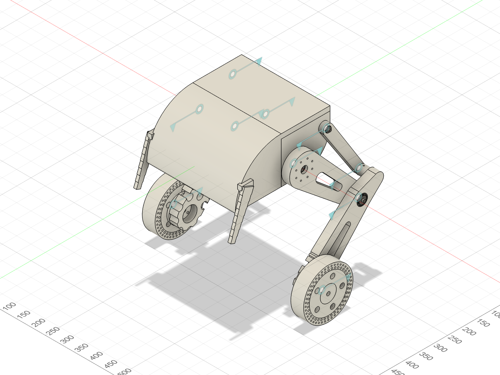

# TWLR — 2륜 밸런싱 로봇 (한국항공대 캡스톤디자인)



이 저장소는 두 부분으로 나뉩니다.

| | 내용 | 진입점 |
|---|---|---|
| **기구 설계 (CAD)** | Fusion 360 어셈블리, 3D 프린팅 STL, 구조·정역학 해석 | **[`hardware/`](hardware/)** |
| **ROS 2 description** | URDF/xacro, 메시, RViz·robot_state_publisher 런치 | [`urdf/`](urdf/) · 아래 섹션 |

## 기구 설계 요약 → [`hardware/README.md`](hardware/README.md)

| | |
|---|---|
| Fusion 문서 | `TWLR_assembly_AK45` (컴포넌트 31 / 오컬런스 55 / 타임라인 281) |
| 총질량 | **11.19 kg** (PLA 벽 6줄 / 인필 20 %) |
| 무게중심 | 지면 위 **270.8 mm**, 휠축 위 **184.8 mm**, 좌우 대칭 X = 0.000 mm |
| 고관절 | CubeMars **AK45-36 V3.0 KV80** × 2 — 직립 시 필요토크 **9.51 N·m** (정격 8 의 119 %, 피크 24 의 40 %) |
| 휠 | **WA172E** 인휠모터 Ø172 × 2 (4-M6 PCD36 체결) |
| 다리 | 좌우 **4절 링크**, 가동범위 Δθ = −27.1° … +36.1° |

**어셈블리 애니메이션**: [`hardware/media/assembly-animation.mp4`](hardware/media/assembly-animation.mp4) (27 s)

상세 문서: [01 고관절 AK45](docs/mechanical/01-hip-actuator-AK45.md) ·
[02 조인트/부시/샤프트](docs/mechanical/02-joints-bushings-shafts.md) ·
[03 질량·무게중심·힙토크](docs/mechanical/03-mass-cog-hip-torque.md) ·
[04 3D프린팅 방향·인필](docs/mechanical/04-print-orientation-infill.md)

**발표자료**: [2026-2학기 1주차 — 하드웨어 제작·설계 및 시뮬레이션 결과 보고](docs/presentations/2026-2-week1/)
(슬라이드 12장 + Simulink 시뮬레이션 영상 4편 + 모터 구동영상 3편 + 어셈블리 영상)

---

# ROS 2 Robot Description

> ⚠️ **아래 URDF 는 구버전 Fusion 모델에서 자동생성된 것입니다.**
> 질량 63.541 kg, 링크명 `link1`/`link3` 등은 현재 CAD(`TWLR_assembly_AK45`, 11.19 kg)와 맞지 않습니다.
> 기구가 확정되었으므로 URDF 재생성이 필요합니다 — 실제 질량·관성값은
> [`hardware/analysis/results/mass-and-cog.txt`](hardware/analysis/results/mass-and-cog.txt) 참고.

## Overview (구버전 자동생성값)

| Property | Value |
|----------|-------|
| Total mass | 63.541 kg *(실제 11.19 kg)* |
| Links | 7 |
| Joints | 6 (6 movable) |
| Assemblies | 14 |
| Root link | `base_link` |

## Table of Contents

- [Kinematic Tree](#kinematic-tree)
- [Link Properties](#link-properties)
- [Joint Properties](#joint-properties)
- [Assembly Breakdown](#assembly-breakdown)
- [Quick Start (ROS 2)](#quick-start-ros-2)
- [Files](#files)

## Kinematic Tree

```
base_link
  └─ hip_right [continuous]
    link1_right [BAKE]
      └─ knee_right [continuous]
        link3_right [BAKE]
          └─ wheel_right [continuous]
            wheel_right [BAKE]
      └─ hip_left [continuous]
        link1_left [BAKE]
          └─ knee_left [continuous]
            link3_left [BAKE]
              └─ wheel_left [continuous]
                wheel_left [BAKE]
```

## Link Properties

| Link | Mass (kg) | Material | Collision | Bodies |
|------|-----------|----------|-----------|--------|
| `base_link` | 46.8047 | material | cylinder | 1 |
| `link1_left` | 0.6681 | material | box | 1 |
| `link1_right` | 0.6681 | material | box | 1 |
| `link3_left` | 0.8086 | material | cylinder | 1 |
| `link3_right` | 0.8086 | material | cylinder | 1 |
| `wheel_left` | 6.8914 | material | box | 2 |
| `wheel_right` | 6.8914 | material | box | 2 |

## Joint Properties

| Joint | Type | Parent → Child | Axis | Limits |
|-------|------|---------------|------|--------|
| `hip_left` | continuous | `link1_right` → `link1_left` | (1,0,0) | — |
| `hip_right` | continuous | `base_link` → `link1_right` | (1,0,0) | — |
| `knee_left` | continuous | `link1_left` → `link3_left` | (1,0,0) | — |
| `knee_right` | continuous | `link1_right` → `link3_right` | (1,0,0) | — |
| `wheel_left` | continuous | `link3_left` → `wheel_left` | (-0,0,-1) | — |
| `wheel_right` | continuous | `link3_right` → `wheel_right` | (0,-0,-1) | — |

## Assembly Breakdown

### CD74HC4050PW

- **Links**: 
- **Total mass**: 0.000 kg

### DIANOME_PDB_1

- **Links**: 
- **Total mass**: 0.000 kg

### DP83825IRMQT

- **Links**: 
- **Total mass**: 0.000 kg

### IMU_sensor

- **Links**: 
- **Total mass**: 0.000 kg

### Orange_pi

- **Links**: 
- **Total mass**: 0.000 kg

### PIN1_ASM

- **Links**: 
- **Total mass**: 0.000 kg

### PIN_24_1_2_54

- **Links**: 
- **Total mass**: 0.000 kg

### PIN_24_1_2_54_1

- **Links**: 
- **Total mass**: 0.000 kg

### SSD_ASM

- **Links**: 
- **Total mass**: 0.000 kg

### TWLR

- **Links**: base_link, link1_right, link3_right, wheel_right, wheel_left, link1_left, link3_left
- **Total mass**: 63.541 kg

### Teensy_4_1

- **Links**: 
- **Total mass**: 0.000 kg

### USB_ASM

- **Links**: 
- **Total mass**: 0.000 kg

### reset_button

- **Links**: 
- **Total mass**: 0.000 kg

### servo_left

- **Links**: 
- **Total mass**: 0.000 kg

## Quick Start (ROS 2)

```bash
# 1. Copy package to your ROS 2 workspace
cp -r TWLR_description ~/ros2_ws/src/

# 2. Build
cd ~/ros2_ws
colcon build --packages-select TWLR_description
source install/setup.bash

# 3. Visualize in RViz2
ros2 launch TWLR_description display.launch.py

# 4. Validate URDF structure
check_urdf install/TWLR_description/share/TWLR_description/urdf/TWLR.urdf

# 5. Print kinematic tree
urdf_to_graphviz install/TWLR_description/share/TWLR_description/urdf/TWLR.urdf
```

**Joint control**: The launch file includes `joint_state_publisher_gui` —
use the sliders to move revolute/prismatic joints in RViz2.

**Topic inspection**:
```bash
# See published joint states
ros2 topic echo /joint_states

# See robot description parameter
ros2 param get /robot_state_publisher robot_description
```

## Files

| Path | Description |
|------|-------------|
| `urdf/TWLR.urdf.xacro` | Top-level xacro (entry point) |
| `urdf/TWLR.urdf` | Flat URDF (for validation) |
| `urdf/assemblies/` | Per-assembly xacro macros |
| `meshes/` | Visual (OBJ) and collision (STL) meshes |
| `launch/display.launch.py` | Launch robot_state_publisher, RViz, and generated controllers |
| `config/joint_state.yaml` | Joint state publisher config |
| `config/ros2_controllers.yaml` | Generated ros2_control controller manager config |
| `robot_data.yaml` | Supplementary data (beyond URDF) |
| `docs/transforms.md` | Transformation matrices (KaTeX) |
| `hardware/` | **기구 설계 — CAD, STL, 해석 (아래 표)** |
| `hardware/cad/TWLR_assembly_AK45.f3d` | Fusion 360 어셈블리 원본 |
| `hardware/cad/step/` | 신규 가공품 STEP (허브·마운트링·샤프트 3종) |
| `hardware/print/print-ready/` | 슬라이서용 STL — 구멍 없음 + 눕힘 + 베드 최적 회전 |
| `hardware/print/as-designed/` | 설계 그대로의 STL (구멍 포함) |
| `hardware/analysis/` | 질량·힙토크·볼트·프린팅 강도 해석 스크립트 + 결과 |
| `hardware/media/assembly-animation.mp4` | 어셈블리 애니메이션 |
| `docs/mechanical/` | 기구 설계 상세 문서 4편 |
| `docs/presentations/2026-2-week1/` | 2026-2학기 1주차 발표자료 (슬라이드·PDF·영상) |

## Customizing

Assemblies tagged `!dummy_` are designed to be swapped out. To replace one:

1. Create your replacement as a xacro macro with the same interface
2. Place it in `urdf/assemblies/`
3. Update the `<xacro:include>` in `urdf/TWLR.urdf.xacro`
4. Update meshes in `meshes/<your_assembly>/`

The xacro prefix system (`${prefix}`) ensures link names stay unique
when multiple instances of the same assembly are used.

---
*Generated by Fusion URDF/XACRO Exporter v3.0.0*