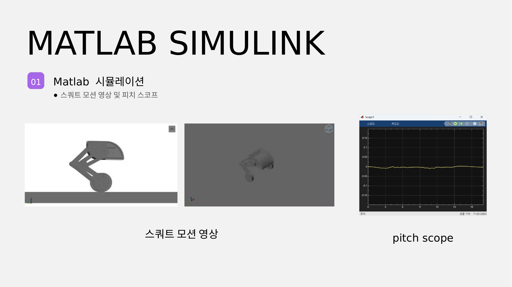
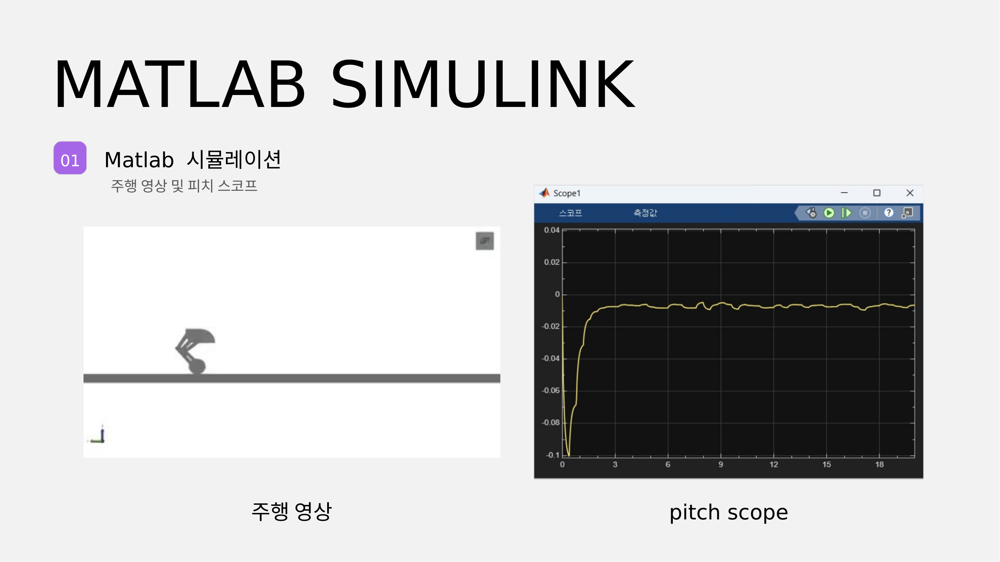
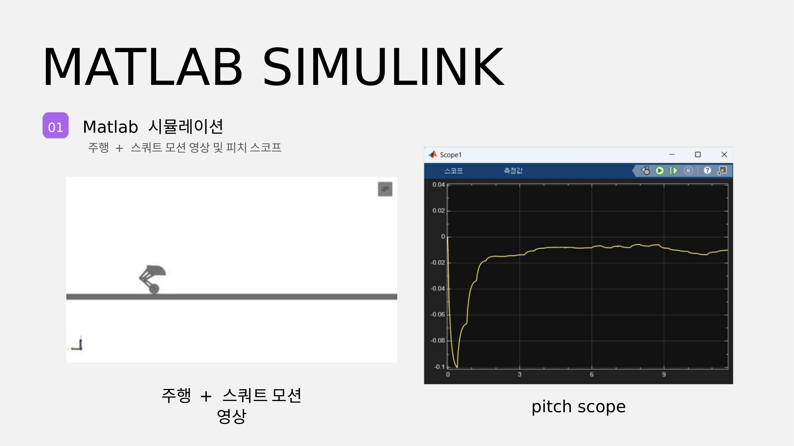
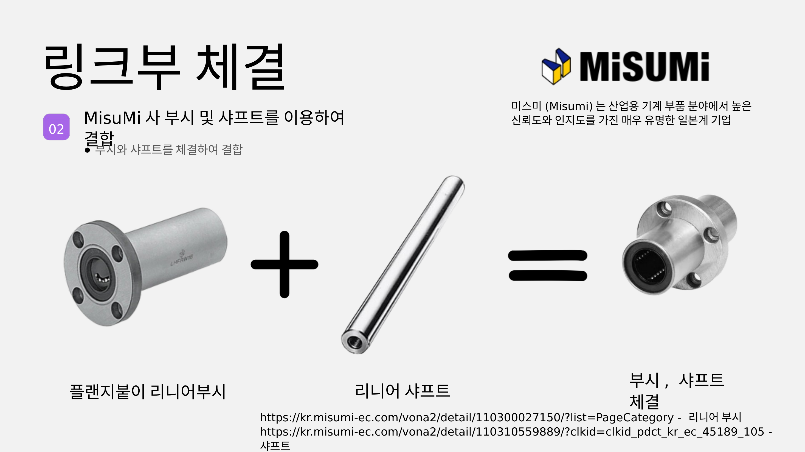
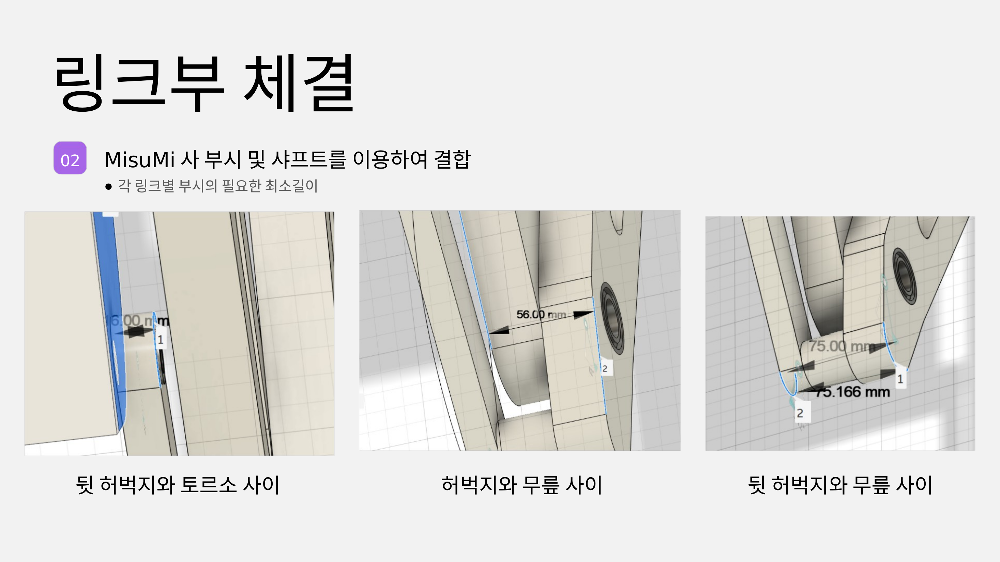
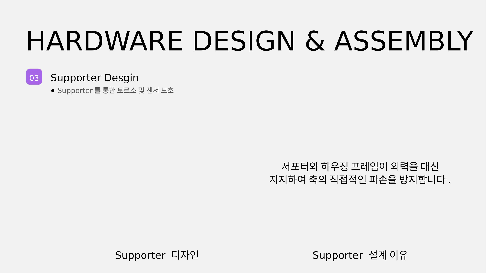
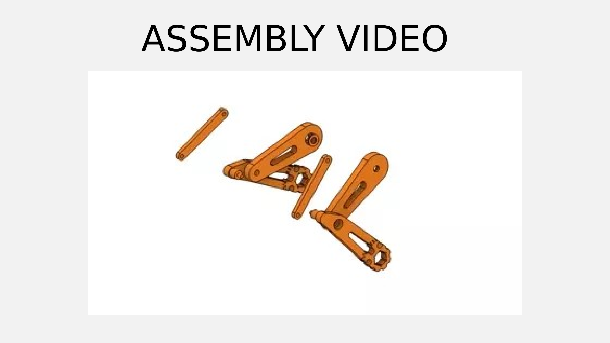
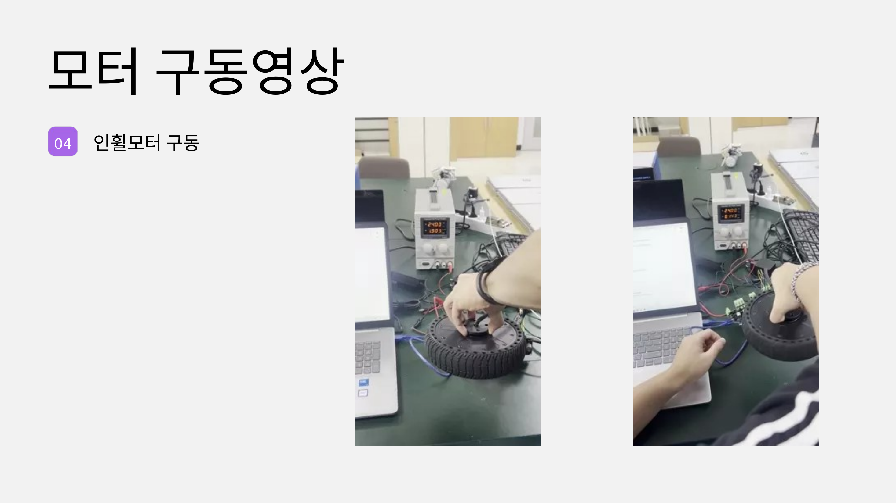
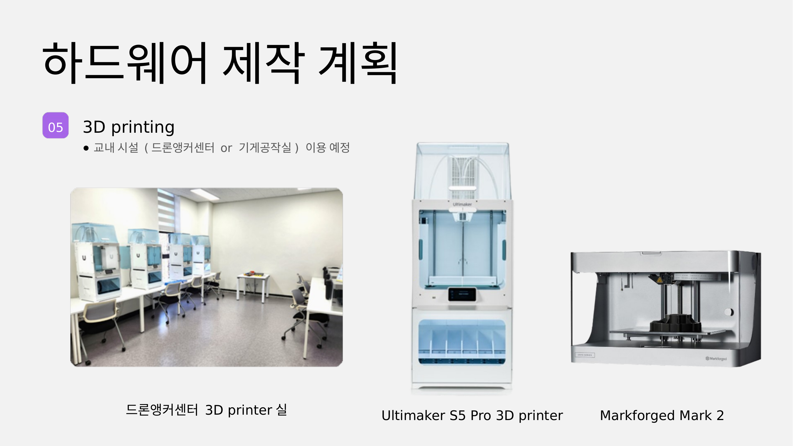

# 2026-2학기 1주차 발표 — 하드웨어 제작·설계 및 시뮬레이션 결과 보고

2조 · 발표일 2026-09-07 · 슬라이드 12장 · 다음: [2주차](../2026-2-week2/) · [3주차](../2026-2-week3/)

- 전체 슬라이드 PDF: [`2026-2-week1.pdf`](2026-2-week1.pdf)
- 원본 `.pptx` (101 MB) 는 GitHub 파일 크기 제한 때문에 커밋하지 않고, **슬라이드 이미지 + 영상 + PDF** 로 분해해 넣었습니다.
- 영상은 전부 H.264 로 재인코딩했습니다 (원본 .mov 는 HEVC 라 브라우저에서 재생 안 됨).

## 목차

| # | 섹션 | 내용 |
|---|---|---|
| 01 | MATLAB Simulink | 스쿼트 모션 / 주행 / 주행+스쿼트 영상 및 피치 스코프 |
| 02 | 링크부 체결 | MISUMI 부시·샤프트 결합, 링크별 부시 최소길이 |
| 03 | Hardware Design & Assembly | Supporter 설계, Assembly Video |
| 04 | 모터 구동영상 | 서보모터 / 인휠모터 |
| 05 | 하드웨어 제작 계획 | 3D printing (교내 드론앵커센터 / 기계공작실) |

---

## 01 — MATLAB Simulink

**스쿼트 모션** — [측면 뷰](video/sim-squat-side.mp4) · [등각 뷰](video/sim-squat-iso.mp4)

**주행** — [영상](video/sim-drive.mp4)

**주행 + 스쿼트** — [영상](video/sim-drive-squat.mp4)

---

## 02 — 링크부 체결

> ⚠️ **발표 후 정정**: 이 슬라이드에 링크된
> [MISUMI 110300027150 플랜지붙이 리니어부시](https://kr.misumi-ec.com/vona2/detail/110300027150/) 는
> **볼 리니어부시(LM 부시)로 직선 왕복 전용**입니다. 회전시키면 볼이 궤도를 압흔(brinelling)시켜
> 수 시간 만에 유격이 생깁니다. TWLR 의 A·KNEE·B 조인트는 전부 요동 회전이므로 사용 불가.
> → **오일리스 부시(MPFZ) / OILES GSF / DU 부시**로 대체.
> 샤프트도 **양단 암나사 타입(SFJ/PSFJ)** 을 골라야 합니다.
> 상세: [`../../mechanical/02-joints-bushings-shafts.md`](../../mechanical/02-joints-bushings-shafts.md#3-misumi-부품--️-선택하신-품번은-회전에-쓰면-안-됩니다)

**부시 최소길이** — 계산 결과 면압은 전혀 제약이 아니고(필요 L ≈ 1.0 mm),
길이는 **미스얼라인 방지 기준 L/d ≥ 1.0** 으로 잡아야 합니다. 현재 L15/Ø12 = 1.25 ✓

| 조인트 | 위치 (Y, Z) | 하중(3G) | 축경 | 필요 L | 현재 |
|---|---|---|---|---|---|
| A (토르소 ↔ 보조링크) | (114, 49) | ≈250 N | Ø12 | 1.0 mm | L15 ✓ |
| KNEE (허벅지 ↔ 종아리) | (174, −164) | ≈560 N | Ø20 | 6904ZZ ×2 | ✓ |
| B (보조링크 ↔ 종아리) | (228.5, −128.6) | ≈250 N | Ø12 | 1.0 mm | L15 ✓ |

---

## 03 — Hardware Design & Assembly

**Supporter** — 서포터와 하우징 프레임이 외력을 대신 지지해 축의 직접적인 파손을 방지.

### Assembly Video

▶ **[어셈블리 애니메이션 (27 s)](../../../hardware/media/assembly-animation.mp4)**

---

## 04 — 모터 구동영상

**서보모터 (AK45-36)** — [구동 영상](video/motor-servo-AK45.mp4)

**인휠모터 (WA172E)** — [영상 1](video/motor-inwheel-1.mp4) · [영상 2](video/motor-inwheel-2.mp4)

---

## 05 — 하드웨어 제작 계획

교내 시설(드론앵커센터 / 기계공작실) 이용 예정 — **Ultimaker S5 Pro**, **Markforged Mark 2**

> 발표 이후 Ultimaker S5(330×240×300) 기준으로 베드 적재를 다시 검토했습니다.
> 축정렬 bbox 로는 허벅지·정강이가 안 들어가지만 **회전시키면 전부 눕혀서 들어갑니다**
> (허벅지 166.25°, 정강이 9.75°, 보조링크 150.28°). 눕힘 + 벽 6줄 + 인필 20 % 확정.
> 상세: [`../../mechanical/04-print-orientation-infill.md`](../../mechanical/04-print-orientation-infill.md)
> · 슬라이서 설정: [`../../../hardware/print/README.md`](../../../hardware/print/README.md)

---

## 발표 이후 진행된 설계 변경

| 항목 | 발표 시점 | 현재 |
|---|---|---|
| 고관절 | 미정 | CubeMars AK45-36 V3.0 KV80 + 출력 허브 + 마운트 링 ([01](../../mechanical/01-hip-actuator-AK45.md)) → **2026-10 Damiao DM-J4340P-2EC 로 교체** ([05](../../mechanical/05-hip-actuator-DM4340P.md)) |
| 휠 체결 | 6 × Ø6 PCD54 (대응 탭홀 없음) | 4 × M6 PCD36 + Ø49.95 스피곳 |
| 부시 | 리니어부시 (회전 불가) | 오일리스/DU 부시 + 양단 탭 샤프트 3종 신설 |
| 질량 | — | 11.187 kg, CoG 지면 위 270.8 mm |
| 힙 토크 | — | 9.51 N·m @Δθ=0 (AK45 정격 8 의 119 %) → DM4340P 기준 9.59 N·m (정격 9 의 107 %) ([05](../../mechanical/05-hip-actuator-DM4340P.md)) |
| 3D 프린팅 | 방향 미정 | 눕힘 + 벽 6줄 + 인필 20 %, print-ready STL 6종 |
