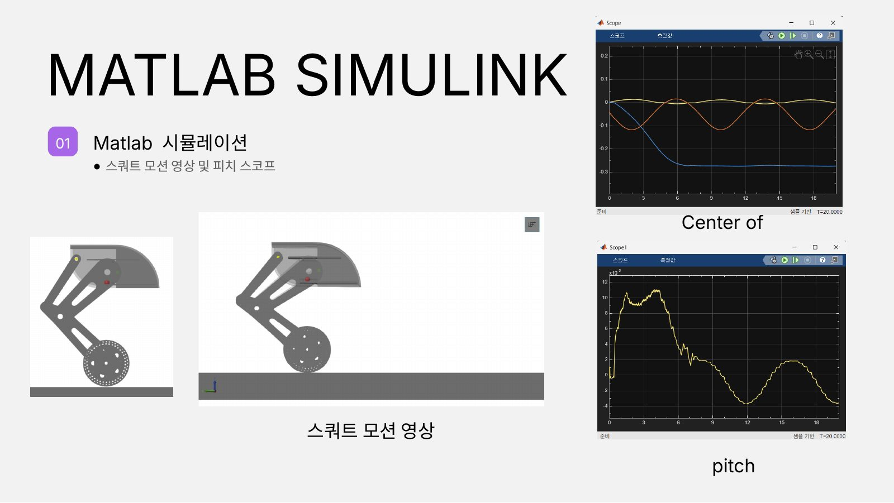
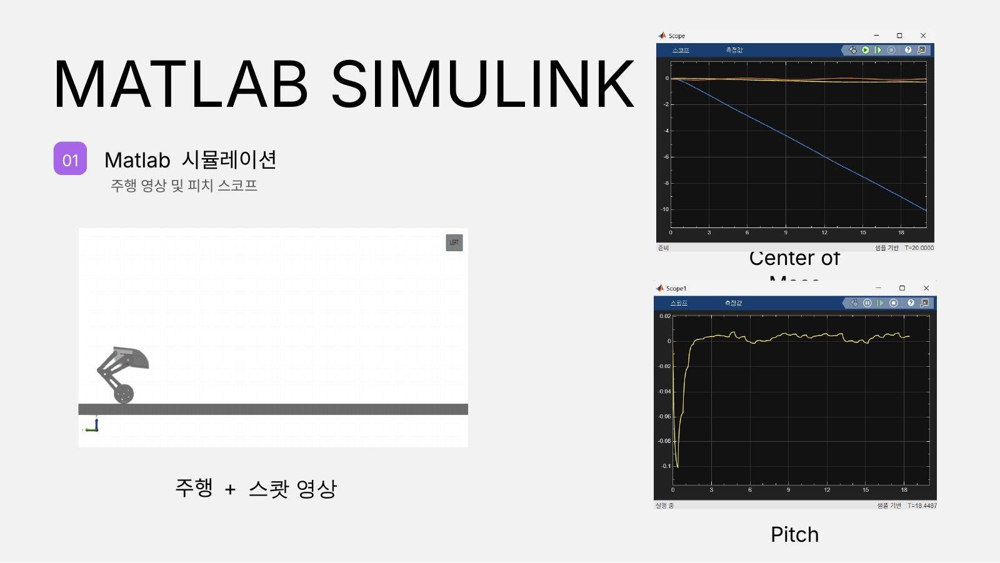
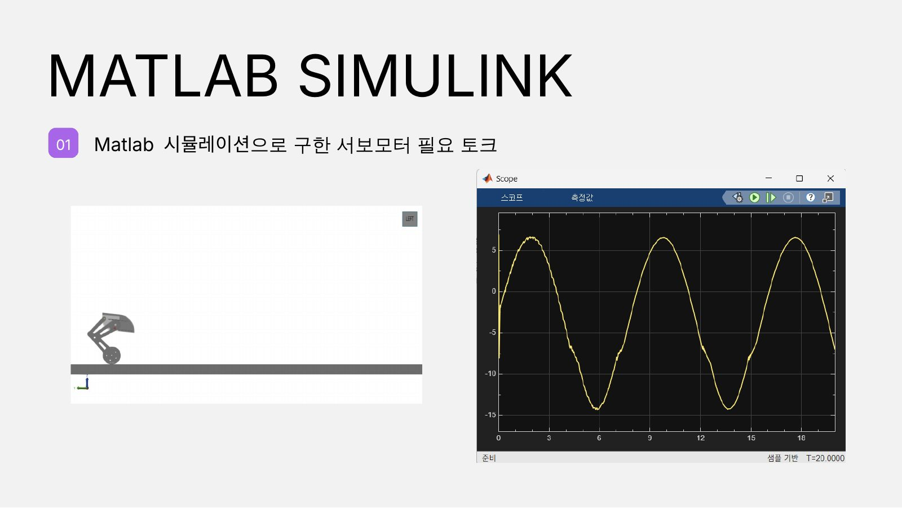
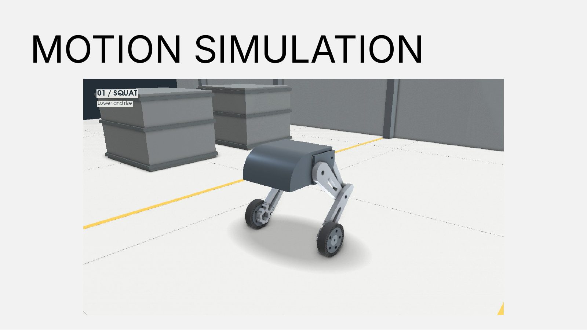
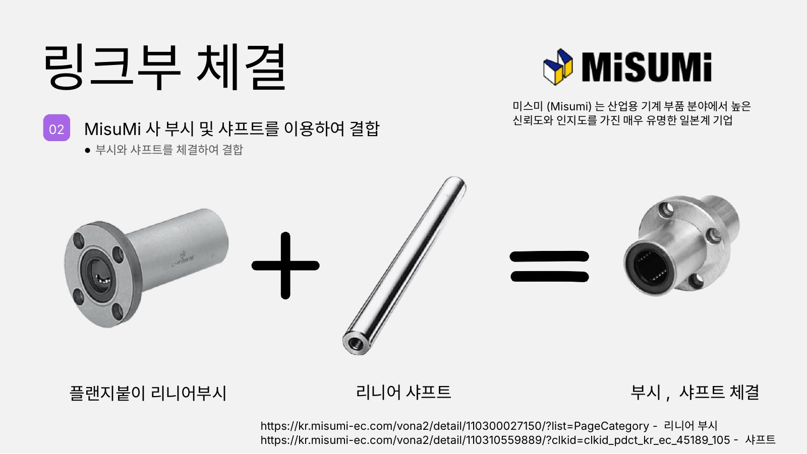
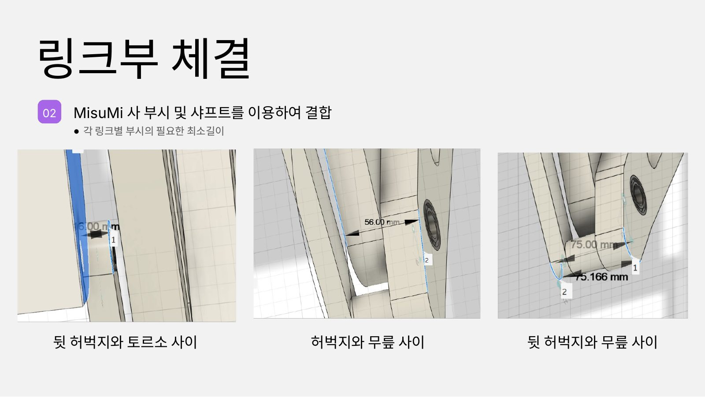
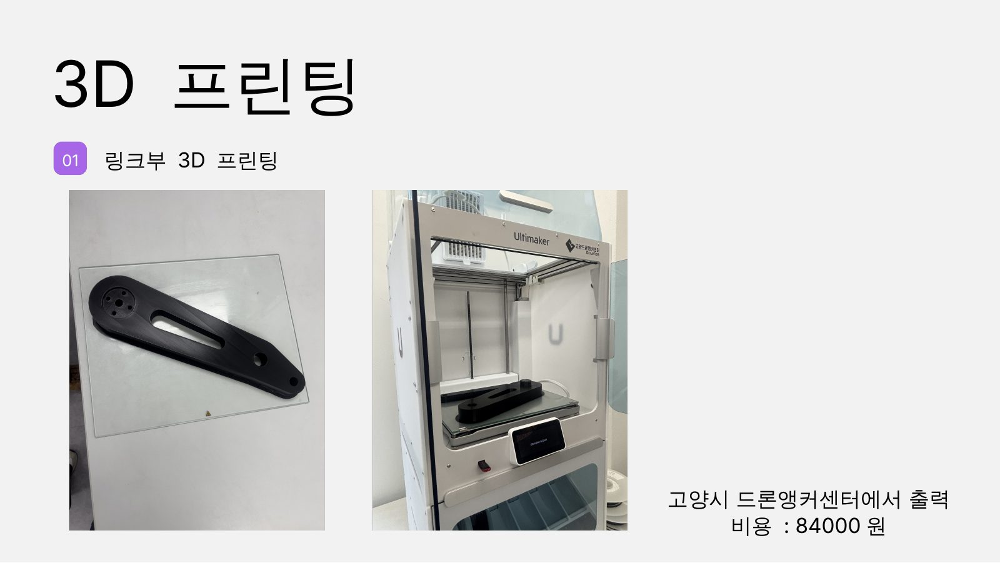
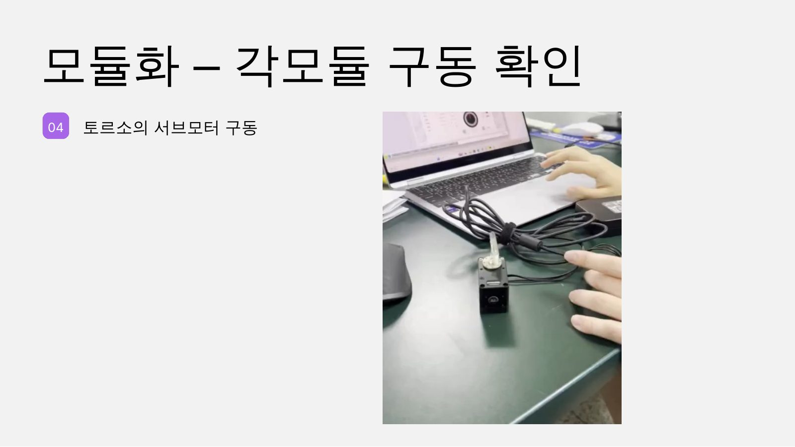
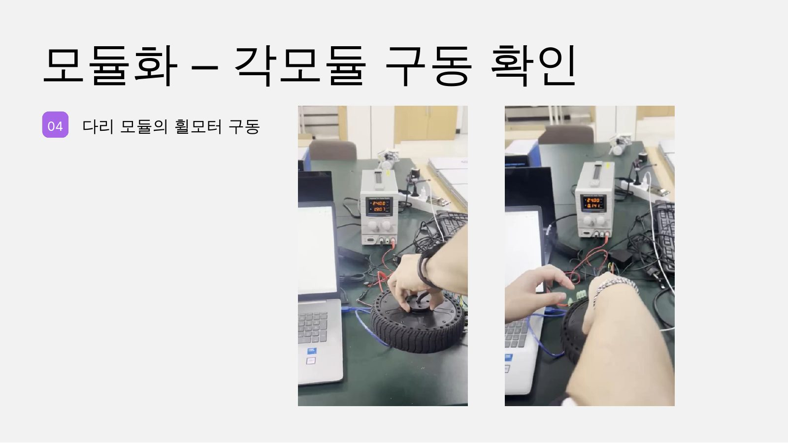

# 2026-2학기 2주차 발표 — 하드웨어 제작 및 시뮬레이션 결과 보고

2조 · 발표일 2026-09-14 · 슬라이드 16장 · 이전: [1주차](../2026-2-week1/) · 다음: [3주차](../2026-2-week3/)

- 전체 슬라이드 PDF: [`2026-2-week2.pdf`](2026-2-week2.pdf) (슬라이드 이미지로 재구성, 원본 `.pptx` 79 MB 는 미커밋)
- 영상은 H.264 / 최대 1280 px 로 재인코딩. 1주차와 같은 영상은 1주차 파일로 링크합니다.

## 목차

| # | 섹션 | 내용 |
|---|---|---|
| 01 | MATLAB Simulink (CoM 추가) | 스쿼트 / 주행+스쿼트 영상과 무게중심·피치 스코프, 서보 필요 토크 |
| — | Motion Simulation | 스쿼트, 전진·후진·밸런싱 |
| 02 | 링크부 체결 | MISUMI 부시·샤프트 결합, 링크별 부시 최소길이 |
| 03 | Assembly Video | 링크 부품 조립 |
| 04 | 3D 프린팅 | 링크부 출력 (고양시 드론앵커센터, 84,000원) |
| 05 | 모듈화 | 토르소 서보모터 / 다리 휠모터 구동 확인 |

---

## 01 — MATLAB Simulink (CoM 추가)

**스쿼트 모션 + 무게중심·피치 스코프** — [영상](video/sim-squat-cog-pitch.mp4)

**주행 + 스쿼트, 피치 스코프** — [영상](video/sim-drive-squat-pitch.mp4)

**Simulink 로 구한 서보모터 필요 토크** — 스쿼트 주기 동안 사인파 형태의 토크 프로파일.

## Motion Simulation

[01 / SQUAT](video/motion-sim-squat.mp4) · [FORWARD + REVERSE / BALANCING](video/motion-sim-drive-balance.mp4)

---

## 02 — 링크부 체결

MISUMI 플랜지붙이 리니어부시 + 리니어 샤프트로 링크 조인트를 결합하고,
조인트별(뒷허벅지–토르소, 허벅지–무릎, 뒷허벅지–무릎) 부시 최소길이를 CAD 에서 측정.

> ⚠️ 리니어부시(볼 부시)는 직선 왕복용이라 요동 회전 조인트에서는 장기 유격 위험 — [02 §3](../../mechanical/02-joints-bushings-shafts.md).

## 03 — Assembly Video

▶ [링크 부품 조립 영상 (27 s)](video/assembly-links.mp4)
· 최신 전체 어셈블리는 [v2 (36 s)](../../../hardware/media/assembly-animation-v2.mp4)

## 04 — 3D 프린팅

링크부를 **고양시 드론앵커센터** Ultimaker 로 출력 — 비용 **84,000원**.

## 05 — 모듈화: 각 모듈 구동 확인

**토르소의 서보모터 구동** — [영상](../2026-2-week1/video/motor-servo-AK45.mp4) (1주차와 동일 영상)

**다리 모듈의 휠모터 구동** — [영상 1](../2026-2-week1/video/motor-inwheel-1.mp4) · [영상 2](../2026-2-week1/video/motor-inwheel-2.mp4)
