# 2026-2학기 3주차 발표 — 하드웨어 제작 및 센서 구동 테스트

2조 · 발표일 2026-09-21 · 슬라이드 23장 · 이전: [1주차](../2026-2-week1/) · [2주차](../2026-2-week2/)

- 전체 슬라이드 PDF: [`2026-2-week3.pdf`](2026-2-week3.pdf) (슬라이드 이미지로 재구성, 원본 `.pptx` 248 MB 는 미커밋)
- 영상은 H.264 / 최대 1280 px 로 재인코딩 (원본 중 2편은 HEVC 라 브라우저 재생 불가였음).
- 이 발표의 영상자료 3편(토르소 출력 시뮬레이션·어셈블리·쇼케이스)은 [`hardware/media/`](../../../hardware/media/) 에 원본 화질로 있습니다.

## 목차

| # | 섹션 | 내용 |
|---|---|---|
| 01 | 영상자료 | 토르소 3D 프린팅 시뮬레이션 · 어셈블리 · 모션/쇼케이스 |
| 02 | 서보모터 구동각 제한 · 정역학 · 동역학 | 조립·간섭·전달각 한계 → 권장 운용범위, 링크 정역학, T = 5 s 스쿼트 동역학 |
| 03 | 메인보드 부팅 / 환경 테스트 | LattePanda 선정, LattePanda → ODrive 휠 구동 |
| 04 | IMU 테스트 | BNO085 + Teensy 4.1, 쿼터니언 / Roll·Pitch·Yaw 출력, 호스트 파싱 코드 |

---

## 01 — 영상자료

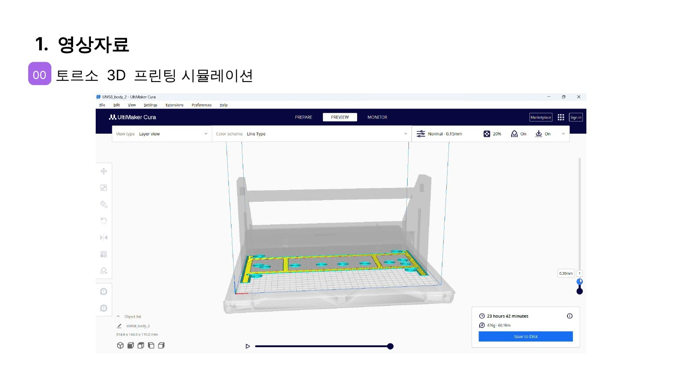

**토르소 3D 프린팅 시뮬레이션** (Ultimaker Cura, UM S5, `body_2`) — **23 h 42 min · 476 g · 60.18 m**
▶ [영상](../../../hardware/media/torso-print-sim-cura.mp4)

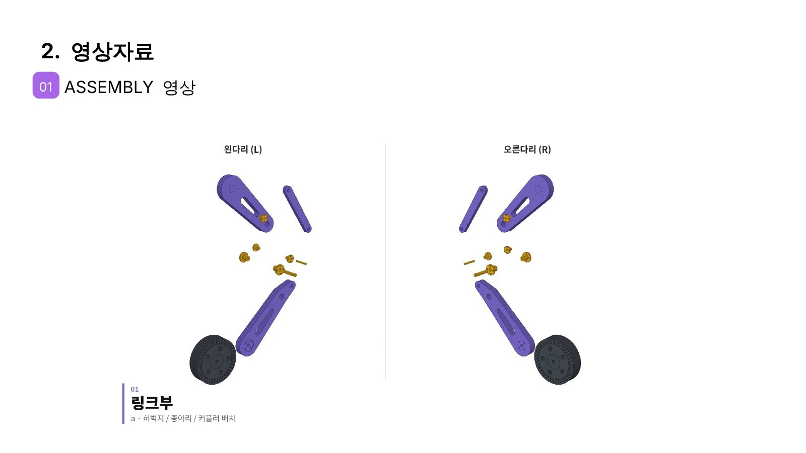

**Assembly** — 링크부(좌/우 다리) → 토르소부(상·하판, 88 mm 지지대, 배터리) → 링크부 + 몸체 결합
▶ [영상 (36 s)](../../../hardware/media/assembly-animation-v2.mp4)

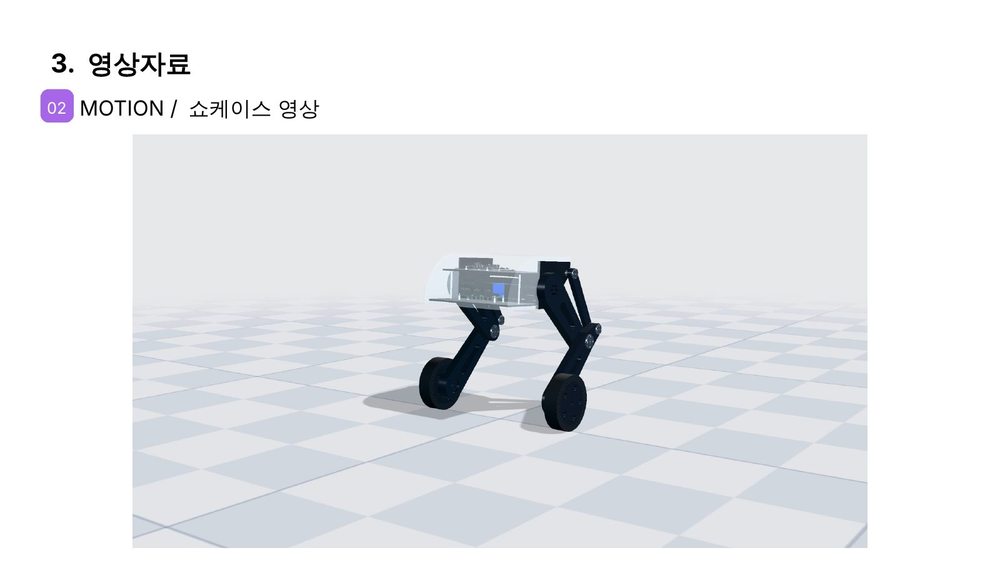

**Motion / 쇼케이스** — 01 SQUAT (서보 축 높이 340–510 mm) · 02 ROLL (좌우 다리 독립 제어, 차체 기울기) ·
03 DRIVE (전진·후진·도립진자 밸런싱) · 04 TURN (휠 선회, 선회 시 기울기 보정)
▶ [영상 (42 s)](../../../hardware/media/motion-showcase.mp4)

---

## 02 — 서보모터 구동각 제한

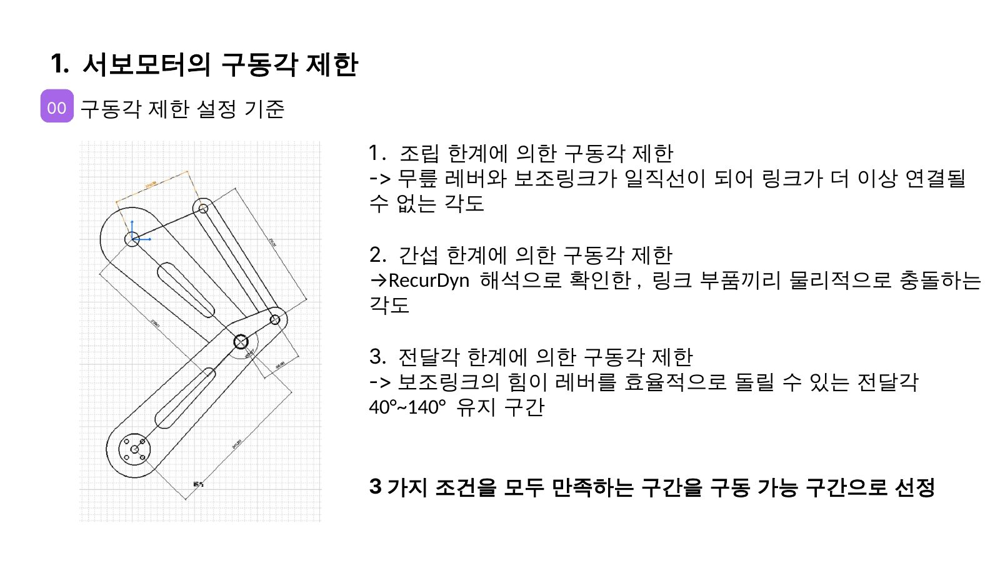

세 조건을 모두 만족하는 구간을 구동 가능 구간으로 선정.

| 기준 | 펴는 쪽 | 접는 쪽 | 근거 |
|---|---|---|---|
| 조립 한계 (삼각형 BCD 성립) | +27.07° | −36.12° | 레버–보조링크 일직선 — [영상](video/kin-assembly-limit.mp4) |
| 간섭 한계 (RecurDyn) | +23.1° | −21.6° | [펴기](video/recurdyn-unfold.mp4) · [접기](video/recurdyn-fold.mp4) |
| 전달각 한계 (40°~140°) | +20.9° | −25.5° | Wilson, *Kinematics and Dynamics of Machinery* p.128 |
| **권장 운용범위** | **+20.9°** | **−21.6°** | [영상](video/operating-range.mp4) |

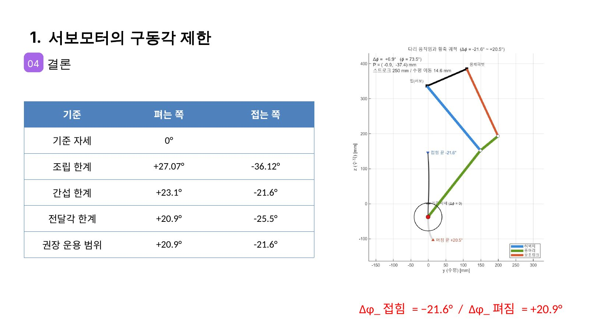

> 조립 한계 ±값은 저장소 기구학 해석(`hip_torque3.py`)의 기구학 한계 −27.08° / +36.12° 와 일치합니다
> (부호만 반대: 발표는 **+ = 펴짐**, 저장소는 **+ = 접힘**).

## 02 — 정역학 해석

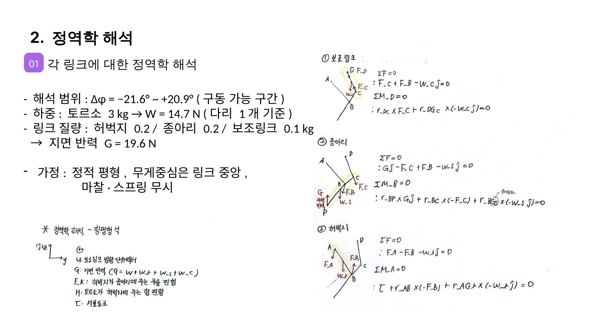

- 해석 범위 Δφ = −21.6° ~ +20.9°, 하중: 토르소 3 kg → 다리 1개당 14.7 N, 링크 0.2/0.2/0.1 kg → 지면반력 19.6 N
- 가정: 정적 평형, 링크 무게중심은 중앙, 마찰·스프링 무시 — [자세별 하중 영상](video/statics-sweep.mp4)

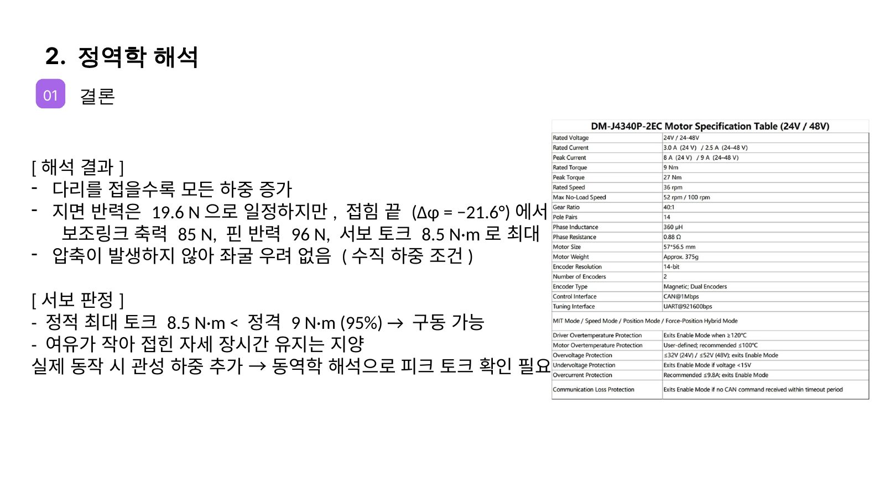

**결과**: 접힐수록 모든 하중 증가 — 접힘 끝(Δφ = −21.6°)에서 보조링크 축력 85 N, 핀 반력 96 N,
**서보 토크 8.5 N·m 최대**. 압축이 없어 좌굴 우려 없음.
**판정**: 8.5 N·m < DM-J4340P 정격 9 N·m (95 %) → 구동 가능, 다만 여유가 작아 접힌 자세 장시간 유지는 지양.

> ⚠️ 저장소의 CAD 질량 모델(토르소·배터리·액추에이터 포함 BODY 4.6 kg)로 같은 자세를 계산하면 **14.5 N·m** 입니다.
> 차이는 토르소 질량 가정(3 kg)에서 옵니다 — [05 §3](../../mechanical/05-hip-actuator-DM4340P.md) 참고.
> 어느 쪽이든 피크 27 N·m 안이라 구동은 가능하지만, 연속 정격 판정이 달라집니다.

## 02 — 기구학 · 동역학

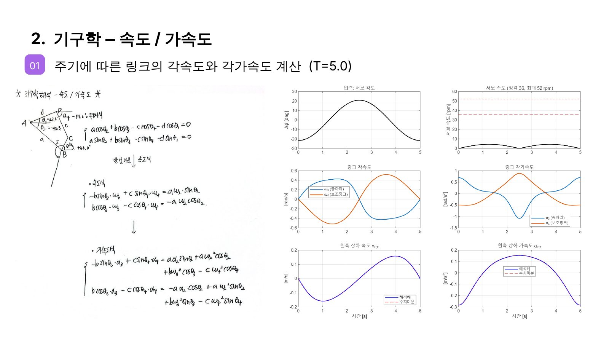

주기 T = 5.0 s 스쿼트에서 링크별 각속도·각가속도 계산.

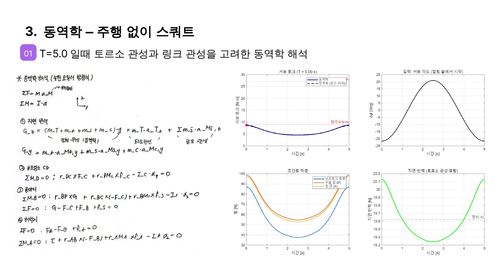

토르소 관성 + 링크 관성을 넣은 뉴턴–오일러 동역학. T = 5 s 에서는 관성 영향이 작아
**동역학 토크 ≈ 정역학 토크 (최대 ≈ 8.6 N·m, 정격 9 N·m 이하)**, 지면반력 변동 19.3~20.1 N.

---

## 03 — 메인보드 부팅 / 환경 테스트

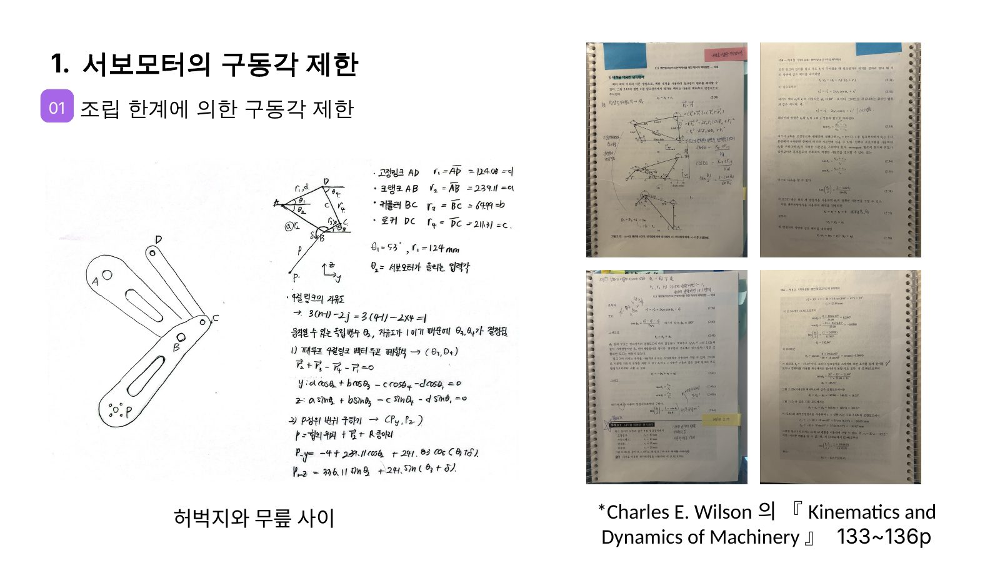

**LattePanda 선정 이유** — Windows 기반 Python/C++ 개발, 센서·MCU 확장성, 소형·경량 온보드 탑재,
고수준 연산(LattePanda)과 실시간 제어(Teensy 4.1)의 역할 분리.

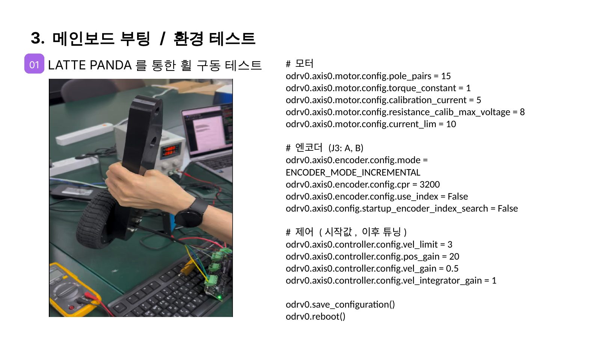

**LattePanda → ODrive 휠 구동 테스트** — ▶ [영상](video/test-lattepanda-wheel.mp4)
설정 코드: [`host/odrive_wheel_config.odrivetool.py`](../../../host/odrive_wheel_config.odrivetool.py)

## 04 — IMU 테스트

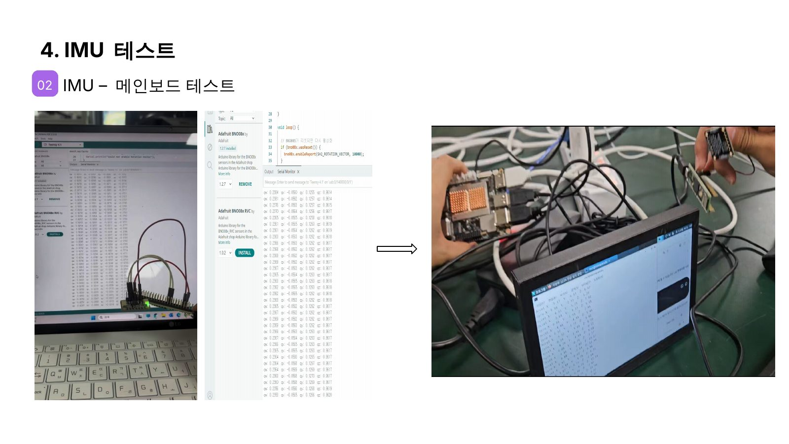

**BNO085 → Teensy 4.1 → 메인보드** — ▶ [영상 1](video/test-imu-1.mp4) · [영상 2](video/test-imu-2.mp4) · [영상 3](video/test-imu-3.mp4)

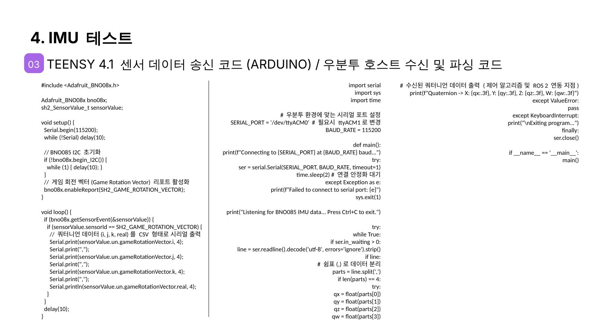

Game Rotation Vector 쿼터니언을 CSV 로 송신, 호스트에서 파싱 → Roll/Pitch/Yaw 로 변환해 3축 자세 추정.

- Teensy 코드: [`firmware/teensy_bno085_quat/teensy_bno085_quat.ino`](../../../firmware/teensy_bno085_quat/teensy_bno085_quat.ino)
- 호스트 코드: [`host/imu_serial_reader.py`](../../../host/imu_serial_reader.py)

---

## 발표 이후 변경 (2026-10)

| 항목 | 발표 시점 | 현재 |
|---|---|---|
| 고관절 액추에이터 | 정역학 판정에 이미 DM-J4340P 사양(정격 9 N·m) 사용 | **Damiao DM-J4340P-2EC 확정** — AK45 배송 지연 ([05](../../mechanical/05-hip-actuator-DM4340P.md)) |
| BOM | — | [`hardware/bom/`](../../../hardware/bom/) — 총 1,184,795원 (3D 프린팅 별도), 루빅 링크 V3 는 서보 변경으로 제외 |
