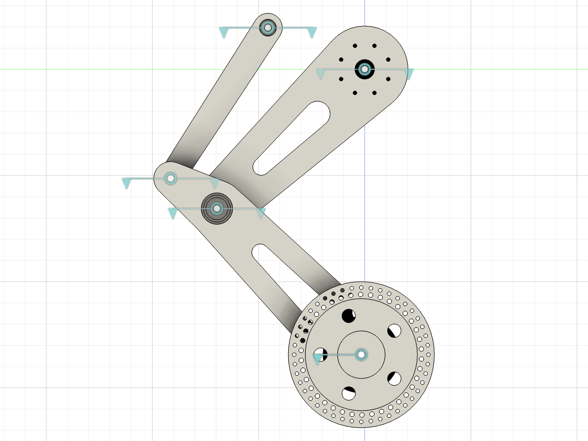
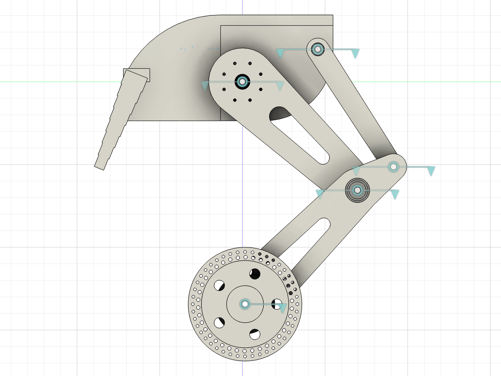

# TWLR — 기구 설계 (Mechanical Design)

한국항공대학교 기계공학과 캡스톤디자인 · 2륜 밸런싱 로봇 **TWLR**

Fusion 360 문서: **`TWLR_assembly_AK45`** — 컴포넌트 31, 오컬런스 55, 타임라인 281, 스냅샷 7

> **2026-10 고관절 액추에이터 변경**: CubeMars AK45-36 → **Damiao DM-J4340P-2EC** (AK45 배송 지연).
> 해석값은 DM4340P 기준으로 갱신했고, CAD 의 허브/마운트링은 아직 AK45 기준입니다 → [05](../docs/mechanical/05-hip-actuator-DM4340P.md)


▶ **어셈블리 애니메이션 v2** (링크부 → 토르소부 → 결합, 36 s): [`media/assembly-animation-v2.mp4`](media/assembly-animation-v2.mp4)
· **모션 쇼케이스** (SQUAT · ROLL · DRIVE · TURN, 42 s): [`media/motion-showcase.mp4`](media/motion-showcase.mp4)
· 토르소 출력 시뮬레이션 (Cura): [`media/torso-print-sim-cura.mp4`](media/torso-print-sim-cura.mp4)
· v1 (27 s): [`media/assembly-animation.mp4`](media/assembly-animation.mp4)

발표자료: [1주차](../docs/presentations/2026-2-week1/) · [2주차](../docs/presentations/2026-2-week2/) · [3주차](../docs/presentations/2026-2-week3/)
· 구매 BOM: [`bom/`](bom/)

| | |
|---|---|
| 총질량 | **11.24 kg** (PLA 벽 6줄 / 인필 20 % 기준, DM4340P 반영) |
| 무게중심 | (0.0, +11.4, −150.5) mm — 지면에서 **271.5 mm**, 휠축 위 **185.5 mm** |
| 고관절 액추에이터 | Damiao **DM-J4340P-2EC** × 2 (40:1, 정격 9 N·m / 피크 27 N·m, CAN, 듀얼 엔코더) |
| 구동 휠 | **WA172E** 인휠모터 Ø172 × 2 |
| 다리 구조 | 좌우 **4절 링크** (허벅지 + 종아리 + 보조링크) |
| 좌우 대칭 | 무게중심 X = 0.000 mm |

<table>
<tr>
<td width="50%"></td>
<td width="50%"></td>
</tr>
<tr><td align="center">좌측 다리 4절 링크</td><td align="center">측면</td></tr>
</table>

---

## 1. 좌표계

어셈블리 원점 = **좌우 고관절 축의 중점**

| 축 | 방향 |
|---|---|
| **X** | 좌우 (우측 +) |
| **Y** | 전후 |
| **Z** | 상하 (위 +) |

지면은 Z = −336 − 86 = **−422 mm** (휠 중심 Z = −336, 휠 반경 86).

## 2. 링크 구조 (4절 링크)

```
        고관절 (0, 0)                     A (114, 49)
             │  L1 = 239.1                     │
             │                                 │ L3 = 211.3
        무릎 (174, −164) ──── L2 = 65.0 ──── B (228.5, −128.6)
             │
             │ 241.8
        휠축 (4, −336)   ← Ø172 인휠모터
```

| 조인트 | 위치 (Y, Z) mm | 연결 | 베어링 / 부시 |
|---|---|---|---|
| **HIP** | (0, 0) | 토르소 ↔ 허벅지 | DM4340P 내장 크로스 롤러 베어링 |
| **A** | (114, 49) | 토르소 ↔ 보조링크 | 플랜지 부시 Ø12/Ø14 L15 |
| **KNEE** | (174, −164) | 허벅지 ↔ 종아리 | 6904ZZ × 2 |
| **B** | (228.5, −128.6) | 보조링크 ↔ 종아리 | 플랜지 부시 Ø12/Ø14 L15 |
| **WHEEL** | (4, −336) | 종아리 ↔ 휠 | 인휠모터 내장 |

고관절 각도 가동범위 Δθ = **−27.1° … +36.1°** (Grashof 조건 및 4절 폐쇄해 기준)

## 3. 부품 목록 (BOM)

### 3-1. 3D 프린팅 (PLA)

| 부품 | 수량 | 체적 | 외형 (T×Y×Z) |
|---|---|---|---|
| `06_Thigh_L` / `08_Thigh_R` 허벅지 | 2 | 604,281 mm³ | 28 × 258 × 248 |
| `07_Shin_L` / `09_Shin_R` 종아리 | 2 | 571,740 mm³ | 65 × 288.5 × 271.4 |
| `02_Coupler_L` / `03_Coupler_R` 보조링크 | 2 | 116,188 mm³ | 16 × 146.5 × 209.6 |
| `Part12` 토르소 메인 | 1 | 1,486,107 mm³ | 308 × 170 × 144 |
| `Part14` 외장 / `Part15` 상판 / `Part16` 하판 | 각 1 | 1,040,771 / 260,945 / 282,257 mm³ | — |

### 3-2. 신규 가공품 (알루미늄 / 강)

| 부품 | 수량 | 체적 | 재질 권고 | 기능 |
|---|---|---|---|---|
| `21_HUB_Hip_Output` | 2 | 49,052 mm³ | **A6061-T6** | 액추에이터 출력 → 허벅지(Ø70/PCD60) 어댑터 — **DM4340P 출력 플랜지에 맞춰 재설계 필요** |
| `22_MNT_AK45_Ring` | 2 | 11,738 mm³ | A6061-T6 | 액추에이터 하우징 ↔ 토르소 끝판 — **DM4340P 하우징 패턴에 맞춰 재설계 필요** |
| `40_SHAFT_A_D17-D12_L27` | 2 | 3,915 mm³ | S45C/SUS304 연마 | A 조인트 단차 샤프트, 양단 M5 탭 |
| `41_SHAFT_KNEE_D20_L56` | 2 | 17,122 mm³ | S45C 연마 (h7) | 무릎 샤프트, 양단 M6 탭 |
| `42_SHAFT_B_D12_L37` | 2 | 4,046 mm³ | S45C 연마 (g6) | B 조인트 샤프트, 편단 M5 탭 |

### 3-3. 구매품

| 품목 | 수량 | 비고 |
|---|---|---|
| **Damiao DM-J4340P-2EC** (24 V) | 2 | 375 g, Ø57 × 56.5, 정격 3.0 A / 피크 8 A — *AK45-36(349 g) 대체* |
| WA172E 인휠모터 Ø172 (BOM 품명: 누리로봇 인휠모터) | 2 | 2,200 g, 4-M6 × 5DP PCD36 + Ø50 스피곳 |
| 6904ZZ (20×37×9) | 4 | 무릎 |
| 6905 (25×42×9) | 4 | **현재 무기능** — 제거 시 199 g 절감 (§6) |
| 플랜지 부시 Ø12/Ø14 L15 | 4 | DU 부시 권장 ([상세](../docs/mechanical/02-joints-bushings-shafts.md)) |
| M5 + Ø18 와셔 / M5 + Ø30 / M6 + Ø26 / M6 + Ø30 | 4 / 2 / 2 / 2 | 샤프트 축방향 고정 |
| M4 세트스크루 × 8 | 4 | 샤프트 회전방지 |
| 황동 열간삽입 인서트 M4 | 12 | **PLA 직접탭 금지** (안전율 0.47) |
| 6S LiPo (VEGA 그래핀 22.2 V 5200 mAh) | 1 | 700 g |

전체 구매 목록·가격(총 1,184,795원): [`bom/README.md`](bom/README.md)

## 4. 체결 사양 (편차 전부 0.000 mm 검증 — 고관절 2행은 AK45 기준)

| 체결부 | 규격 | 비고 |
|---|---|---|
| 링 ↔ AK45 하우징 | 6 × M3, PCD48 | M3×8 |
| 링 ↔ 토르소 끝판 | 6 × M4, PCD60 | M4×12, 인서트 필수 |
| 허브 ↔ AK45 출력 | 6 × M3, PCD27 + Ø18h7 스피곳 + **3 × Ø4 다웰** | 다웰 없으면 안전율 1.10 → 미끄러짐 |
| 허브 ↔ 허벅지 | 8 × M4, PCD60 | M4×35, 허브에 탭 |
| 종아리 ↔ WA172E | 4 × M6, PCD36 + Ø49.95 스피곳 | **Ø18 대형와셔 + 조임 4~6 N·m 제한** |

## 4-1. 전장 구성 (2·3주차 진행)

| 계층 | 부품 | 역할 / 확인 상태 |
|---|---|---|
| 상위 제어기 | **LattePanda** (4 GB / 64 GB, Win10 Ent.) | 상태 모니터링·데이터 처리, Teensy 에 목표 자세·속도 전달 — 부팅·환경 테스트 완료 |
| 하위 제어기 | **Teensy 4.1** | IMU 수신, 액추에이터 지령 — USB 시리얼로 상위와 연결 |
| 자세 센서 | **BNO085** IMU (I²C) | Game Rotation Vector 쿼터니언 → Roll/Pitch/Yaw 변환 출력 확인 |
| 고관절 | DM4340P × 2 | CAN 1 Mbps (CAN 트랜시버 경유) |
| 휠 | WA172E × 2 + ODrive | LattePanda 에서 ODrive 설정·속도 제어 구동 확인 (pole_pairs 15, cpr 3200) |
| 전원 | 6S 22.2 V + 24 → 5 V 강압 | XT90 |

코드·영상: [3주차 발표](../docs/presentations/2026-2-week3/)

## 5. 해석 요약

| 항목 | 결과 | 상세 |
|---|---|---|
| 총질량 / 무게중심 | 11.24 kg / 지면 위 271.5 mm | [03](../docs/mechanical/03-mass-cog-hip-torque.md) |
| 고관절 필요토크 | **9.59 N·m** @Δθ=0 (DM4340P 정격 9 N·m의 107 %, 피크 27 N·m의 36 %) | [05](../docs/mechanical/05-hip-actuator-DM4340P.md) |
| 연속운전 가능 구간 | Δθ ≤ −5.5° (정격 9 N·m) · 피크 27 N·m 도달 Δθ = +31.8° | [05](../docs/mechanical/05-hip-actuator-DM4340P.md) |
| 팀 권장 운용범위 접힘 끝 (Δθ = +21.6°) | 14.50 N·m (정격 161 %, 피크 54 %) — 팀 정역학 8.5 N·m 와 질량 가정 차이 확인 필요 | [05 §3](../docs/mechanical/05-hip-actuator-DM4340P.md) |
| 링크 굽힘 (3G 착지) | 눕혀 출력 시 SF 1.65 / 세워 출력 시 1.21 | [04](../docs/mechanical/04-print-orientation-infill.md) |
| 고관절 캔틸레버 | 정지 6.54 / 3G 19.61 N·m vs 베어링 ≈27.6 N·m | [02](../docs/mechanical/02-joints-bushings-shafts.md) |
| 간섭 해석 (55 오컬런스) | 실질 간섭 **0건** | [01](../docs/mechanical/01-hip-actuator-AK45.md) |

## 6. 미해결 / 판단 필요

1. **6905 베어링 4개 무기능** — 허브가 허벅지에 직결이라 내륜에 들어갈 축이 없음. 제거 시 199 g 절감.
2. **고관절 모멘트 지지 보강** — 허브 Ø36 축이 AK45 출력 베어링에서 22 mm 캔틸레버. 허브 축을 Ø35로 낮추고 토르소 보어를 Ø47로 넓혀 6807(35×47×7) 삽입하면 해소. 토르소 가공 필요로 미반영.
3. **CAD 의 액추에이터는 AK45 플레이스홀더** — DM4340P 설치도면으로 `21_HUB`·`22_MNT` 재설계, 토르소 격벽 관통 Ø56 → Ø58 이상.
4. **토르소 질량 확인** — 팀 정역학은 토르소 3 kg 가정, CAD 모델은 BODY 4.6 kg. 실측 후 한쪽으로 통일.
5. **백래시** — AK45 기준 ±1.17 mm(휠 위치). DM4340P 백래시는 사양 미공개 → 실측 필요.
6. **URDF의 질량값(63.5 kg)은 구버전 자동생성분** — 실제 11.24 kg. `urdf/` 재생성 필요.

## 7. 디렉터리

```
hardware/
├── cad/
│   ├── TWLR_assembly_AK45.f3d      Fusion 360 원본 (6.9 MB)
│   └── step/                        신규 가공품 STEP 5종
├── print/
│   ├── print-ready/  *_PRINT.stl    구멍 없음 + 눕힘 + 베드 최적 회전 + Z=0
│   ├── as-designed/  *.stl          설계 그대로 (구멍 포함)
│   └── README.md                    슬라이서 설정
├── analysis/         재현 가능한 파이썬 해석 스크립트 + 결과 (DM4340P 기본, AK45 재현 가능)
├── bom/              구매 BOM (xlsx + 요약)
├── media/            어셈블리 애니메이션 v1·v2, 모션 쇼케이스, 토르소 출력 시뮬레이션
└── images/
```

관련 문서: [`docs/mechanical/`](../docs/mechanical/)
